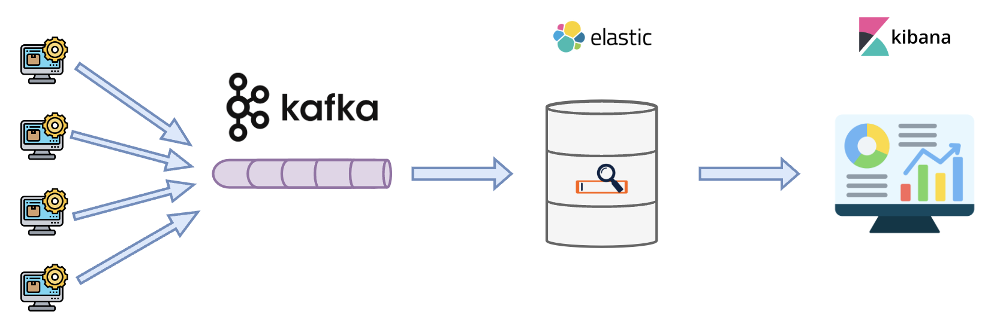
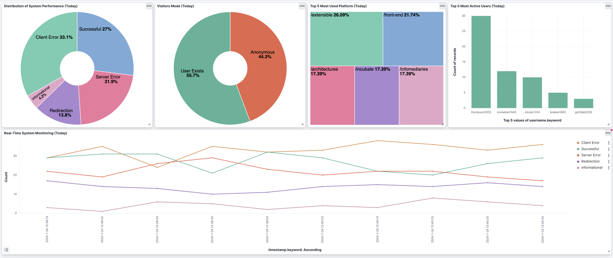
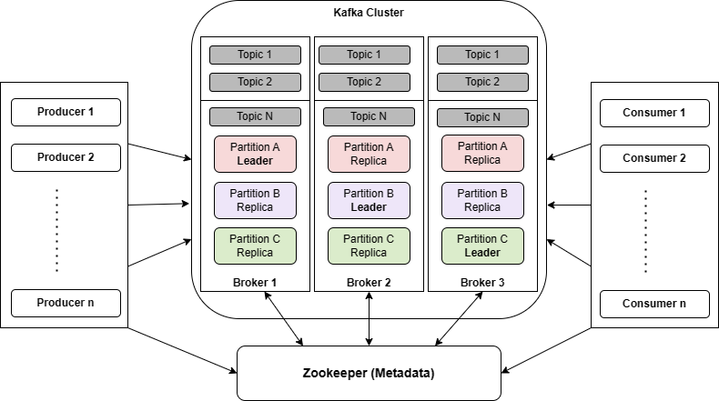
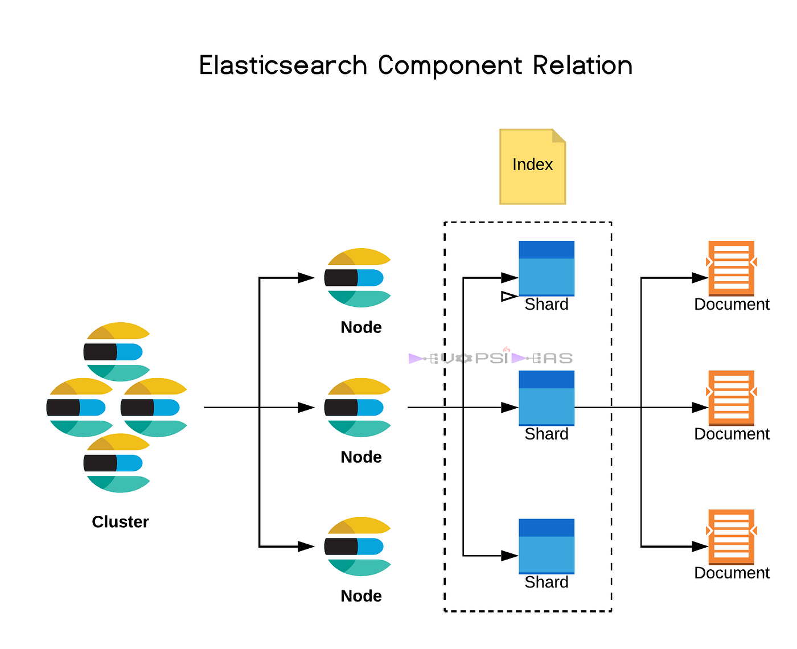

# KafkaInsight: Simulating Real-Time Monitoring System

<p align="center">
  
</p>

## Background:

With the existence of advanced tools like Apache Kafka, ElasticSearch, and Kibana; we are able to build real-time analytics which have multiple use cases. Some examples are the following:

- **Bug Detection** on Production Environment for better maintenance.
- **Data-driven Marketing Strategy** for boosting revenue.
- **Suspicious Account Detection** for better security.

## High Level Overview:

We are collecting logs from multiple platforms and systems (Producers), where all of these logs will be published into a **Kafka** Topic. 

After that, **Elasticsearch** (Consumer) will obtain all the data that were streamed into the Kafka Topic, where all of these data will be stored in its database for search engine optimization.

Eventually, we will be able to visualize the data that are available in the Elasticsearch database using **Kibana**.

The following section shows an example of the simulated real-time monitoring system.

## Simulated Monitoring Tools

<p align="center">
  
</p>

## Logs:

For the simulation, we are going to generate some fakelogs, using https://github.com/mingrammer/flog

I have provided some pre-generated logs for you to test as well.

## Apache Kafka:

<p align="center">
  
</p>

Credit: https://howtodoinjava.com/kafka/apache-kafka-tutorial/

**Apache Kafka** is basically a data streaming platform. It is able to connect multiple producers to send data, which will be consumed by multiple consumers. Normally, the sequence of data is represented as a **queue**, where it applies the **FIFO (First-In-First-Out)** system. The good thing about Apache Kafka is that it allows **asynchronous communication** between the Producers and the Consumers, hence it can be used for **real-time** data processing.

Inside **a Kafka Cluster**, you can define **multiple topics**, where each topic represents the type of data that it streams. For example, in LinkedIn, the topic "Posts" can be used by multiple services to send data that are related to posts.

Within **each topic**, we have multiple partitions, where all data that are sent to a topic will be distributed across **multiple partitions**. Each partition is represented as a **queue**.

But now the question is, how are these partitions distributed across multiple machines? Well, in Apache Kafka, there's a popular term called the **Broker Node**, where it can handle **multiple partitions** across **multiple topics**. The reason why each broker node does not only contain partitions from the same topic is because we want to ensure that Kafka is **highly fault tolerant**. Basically, each partition of a topic will be **replicated** across multiple broker nodes, so that whenever a broker node is down / under maintenance, its operation can still be continued in other nodes.

Now, how do all incoming data ingestion are distributed inside a Kafka cluster? Well, this is where **Apache Zookeeper** is helpful. Zookeeper is basically the supervisor of Apache kafka which can work on the following things:

- **Broker Nodes Registration**
- Stores all **configuration** of the Kafka cluster
- **Leader election** of each broker nodes
- Distribution of **incoming data ingestion** across multiple topics and partitions
- **Partition reassignment** when broker failure is detected
- Handle consumers' request by keeping track of the **offset** of each partition.
- Avoid conflicts during **concurrent** processes and ensure **consistency** by utilizing the **distributed locking mechanism**.

## Elasticsearch:

<p align="center">
  
</p>

Credit: https://medium.com/geekculture/elasticsearch-architecture-1f40b93da719

Elasticsearch is basically a powerful search engine that is distributed across nodes to allow horizontal scaling for handling large scale data. It is able to perform very fast information retrieval (near real-time) due to its inverting index mechanism. This mechanism allows Elasticsearch to map each recognized word into all documents that contains the word along with the position of it inside the documents. 

The good thing about Elasticsearch is that each node within the cluster is able to handle multiple indices. Each index is able to store multiple documents with similar characteristics.

Lastly, Elasticsearch also provides a scheme-free JSON documents format, and hence it provides flexibility in terms of the document's structure.

## Kibana:

<p align="center">
  
</p>

Credit: https://icon-icons.com/icon/elasticco-kibana-logo/169209

Based on all the documents that are stored in the Elasticsearch's NoSQL Database, we are able to easily gain insights by visualizing the data using Kibana.

## Instructions:

1. Clone this repository

2. Generate the logs / Use the existing logs:
    - Follow the instructions here https://github.com/mingrammer/flog

3. Zookeeper + Kafka Cluster Setup:
    - Go to the ./docker-container-generators folder, then run the following command line:

```
docker compose -f docker-compose-kafka.yml up
```

4. ElasticSearch + Kibana Containers Setup:
    - Follow the instructions here: 
        - Elastic Docker Container Setup: https://www.elastic.co/guide/en/elasticsearch/reference/current/docker.html
        - Kibana Docker Setup: https://www.elastic.co/guide/en/kibana/current/docker.html
    - Don't forget to coppy the http_ca.crt to the certificates folder, otherwise you won't be able to connect with the Elastic Docker Container.

5. Go back to the main folder and then create a python environment and install all libraries indicated inside the requirements.txt:
    - If you are new with Python Environment Setup, follow the instructions here: https://www.codewithharry.com/videos/python-tutorials-for-absolute-beginners-43/

6. Go to the ./src folder, then create a .env file containing the ELASTIC_PASSWORD value

7. Send preprocess the logs and send data to the Kafka cluster by running the following command line:

```
python3 kafka_producer.py
```

8. Consume data from the Kafka Cluster and insert the data into the Elasticsearch NoSQL's database by running the following command line:

```
python3 elasticsearch_insertion.py
```

9. Open localhost:5601, and have fun with exploring the visualization, for tutorial (especially for aggregation-based visualization), feel free to use this link: https://www.elastic.co/guide/en/kibana/8.12/add-aggregation-based-visualization-panels.html